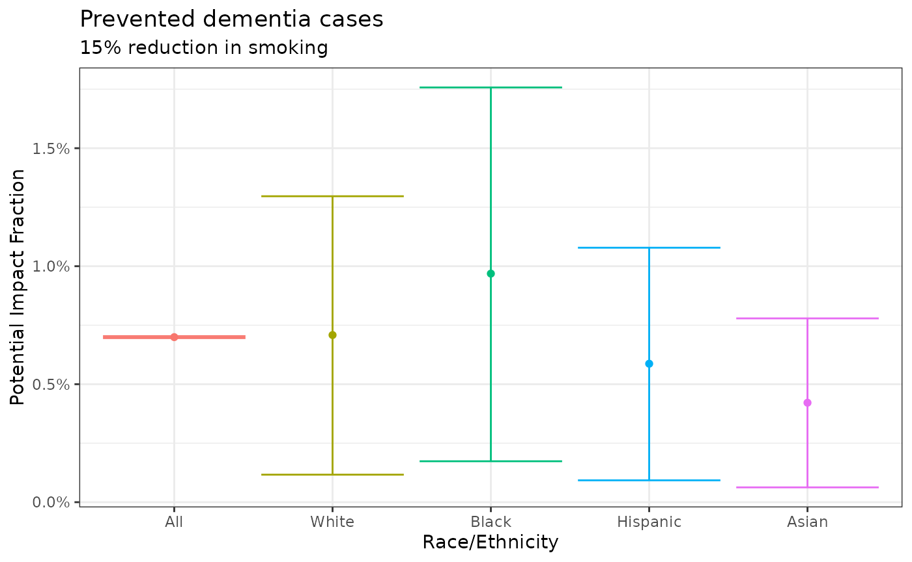

# Introduction

``` r
library(deltapif)
```

## Introduction

The `deltapif` package calculates **Potential Impact Fractions (PIF) and
Population Attributable Fractions (PAF)** for summary data, along with
their confidence intervals, using the delta method. This vignette
provides a practical introduction to the package’s core functionality.

### Core Concepts: PAF and PIF

The **Population Attributable Fraction (PAF)** answers the question:
*“What fraction of disease cases in a population would be prevented if
we completely eliminated a risk factor?”* It represents the maximum
possible reduction achievable and is often interpreted as the burden of
disease attributed to the exposure.

The **Potential Impact Fraction (PIF)** is a more general measure. It
answers: *“What fraction of disease cases would be prevented if we
changed exposure from its current distribution to a specific
counterfactual scenario?”*

PAF is a specific type of PIF where the counterfactual scenario is the
**theoretical minimum risk exposure level (TMREL)**. We remark that the
TMREL is not always zero. For example, the TMREL for sodium intake is a
specific healthy range (e.g., ~1.6g/day), as both too much and too
little sodium are harmful. For other exposures, such as smoking, the
TMREL can indeed be zero exposure.

Example:

- Trieu et al. (2021) estimates the reduction in cardiovascular disease
  cases if the sodium content in packaged foods was reduced to meet
  Australian’s government targets. This is a PIF.

- Estimating the reduction if sodium consumption was changed to the
  ideal TMREL of 1.6g/day would be a PAF, representing the maximum
  achievable benefit.

### Why the Delta Method?

This package uses the delta method to calculate confidence intervals for
PAF and PIF. This approach offers key advantages:

- **Distribution-Free:** It doesn’t require assumptions about the
  underlying distribution of the exposure data in the population, which
  can be difficult to verify and lead to bias if misspecified.

- **Computational Efficiency:**It provides a direct algebraic formula
  for the variance, making it faster and more stable than
  simulation-based methods like Monte Carlo.

- **Transparency:** The formula can be derived and understood, offering
  clarity over “black box” methods.

### Key assumption: Independent (summary) data sources.

The `deltapif` package is designed for a specific, common scenario in
public health:

- The estimate of the relative risk (`beta`) comes from one source
  (e.g., a published meta-analysis).

- The estimate of the exposure prevalence (`p`) comes from a separate,
  independent source (e.g., a national survey).

The delta method implementation here relies on this independence. If you
have individual-level data for exposure the [`pifpaf`
package](https://github.com/INSP-RH/pifpaf) is more appropriate as it
leverages the individual-level variability. If individual-level exposure
and outcome data is available from the same source the [`graphPAF`
package](https://cran.r-project.org/web/packages/graphPAF/index.html) is
ideal.

## Examples

### Example 1: Estimating the PAF for the proportion of dementia attributable to smoking

The article by [M. Lee et al.
(2022)](https://doi.org/10.1001/jamanetworkopen.2022.19672) estimates
the PAF of dementia associated with 12 risk factors (`logrr`) in US
adults. The package includes this data as well as the proportion of
exposed individuals in the respective race column (Hispanic, Asian,
Black and White):

``` r
data(dementiarisk)
```

    #>            risk_factor     logrr       sdlog total hispanic asian black white
    #> 1       Less education 0.4637340 0.119140710  10.7     27.1   6.4  10.6   5.5
    #> 2         Hearing loss 0.6626880 0.174038430  10.8     13.1   6.9   6.5  10.6
    #> 3                  TBI 0.6097656 0.090990178  17.1     10.3   6.0   9.2  20.1
    #> 4         Hypertension 0.4762342 0.167874478  42.2     38.5  38.5  61.0  39.8
    #> 5    Excessive alcohol 0.1655144 0.054020949   3.6      2.0   0.7   2.7   4.2
    #> 6              Obesity 0.4700036 0.091750556  44.0     48.3  14.6  54.3  43.5
    #> 7              Smoking 0.4637340 0.165486566   8.5      6.9   4.9  11.7   8.4
    #> 8           Depression 0.6418539 0.103984905   7.4     10.7   4.3   6.6   7.2
    #> 9     Social isolation 0.4510756 0.086112272  11.9     24.0   8.0  12.1  10.8
    #> 10 Physical inactivity 0.3293037 0.092961816  62.8     68.6  56.6  73.2  61.3
    #> 11            Diabetes 0.4317824 0.075776055  28.6     41.0  44.1  37.2  25.4
    #> 12       Air pollution 0.0861777 0.009362766  22.8     44.4  55.2  41.3  17.2

In this example, we show how to calculate the population attributable
fraction for **Smoking** among the 4 race groups and then how to
calculate the **Total Population Attributable Fraction** of the overall
population.

Notice that **Smoking** has a log relative risk of:

- `beta = 0.4637340`

with variance of

- `var_beta = 0.0273858` (`= 0.165486566^2`).

Among hispanic individuals 6.9% (`p = 0.069`) smoke. Hence their PAF is:

``` r
paf_hispanic <- paf(p = 0.069, beta = 0.4637340, var_beta = 0.0273858, var_p = 0,
                    rr_link = exp, label = "Hispanic")
paf_hispanic
#> 
#> ── Population Attributable Fraction: [Hispanic] ──
#> 
#> PAF = 3.912% [95% CI: 0.569% to 7.142%]
#> standard_deviation(paf %) = 1.676
```

The other fractions can be computed in the same way noting that 4.9% of
non-hispanic asians, 11.7% of non-hispanic blacks and 8.4% of
non-hispanic whites smoke:

``` r
paf_asian <- paf(p = 0.049, beta = 0.4637340, var_beta = 0.0273858, 
                    var_p = 0, rr_link = exp, label = "Asian")
paf_black <- paf(p = 0.117, beta = 0.4637340, var_beta = 0.0273858, 
                    var_p = 0, rr_link = exp, label = "Black")
paf_white <- paf(p = 0.084, beta = 0.4637340, var_beta = 0.0273858, 
                    var_p = 0, rr_link = exp, label = "White")
```

#### Combining subpopulations into a total

We can calculate the **total population attributable fraction** by
combining the fractions of the subpopulations weighted by the proportion
of the population. According to Wikipedia the distribution in 2020 of
the US population by race was as follows:

``` r
weights <- c("white" = 0.5784, "hispanic" = 0.1873, 
             "black" = 0.1205, "asian" = 0.0592)

#Normalized weights to sum to 1
weights <- weights / sum(weights)
```

The `paf_total` function computes the aggregated `paf` of the whole
population:

``` r
paf_population <- paf_total(paf_white, paf_hispanic, paf_black, 
                            paf_asian, weights = weights, var_weights = 0,
                            label = "All")
paf_population
#> 
#> ── Population Attributable Fraction: [All] ──
#> 
#> PAF = 4.663% [95% CI: 4.486% to 4.839%]
#> standard_deviation(paf %) = 1.979
#> ────────────────────────────────── Components: ─────────────────────────────────
#> • 4.722% (sd %: 2.006) --- [White]
#> • 3.912% (sd %: 1.676) --- [Hispanic]
#> • 6.457% (sd %: 2.694) --- [Black]
#> • 2.810% (sd %: 1.218) --- [Asian]
#> ────────────────────────────────────────────────────────────────────────────────
```

where we set `var_weights = 0` as no covariance matrix was known for the
race distribution data (it does exist its just not on Wikipedia).

The `paf` total implements the following formula:

\\ \textrm{PAF}\_{\text{Total}} = w_1 \cdot \text{PAF}\_{\text{White}} +
w_2 \cdot \text{PAF}\_{\text{Hispanic}} + w_3 \cdot
\text{PAF}\_{\text{Black}} + w_4 \cdot \text{PAF}\_{\text{Asian}} \\

where the weights stand for the proportion of the population in each
subgroup.

The `coef`, `confint`, `summary`, and `as.data.frame` functions have
been extended to allow the user to extract information from a `paf` (or
`pif`):

``` r
as.data.frame(paf_population)
#>        value standard_deviation     ci_low      ci_up confidence type label
#> 1 0.04662895         0.01979259 0.04486196 0.04839268       0.95  PAF   All
```

Attributable cases can be calculated for example using the estimates
from [Dhana et al.
(2023)](https://pmc.ncbi.nlm.nih.gov/articles/PMC10593099/#SD2). They
estimate the number of people with Alzheimer’s Disease in New York, USA
426.5 (400.2, 452.7) thousand. This implies a variance of
`((452.7 - 400.2) / 2*qnorm(0.975))^2 = 2647.005`.

``` r
attributable_cases(426.5, paf_population, variance = 2647)
#> 
#> ── Attributable cases: [All] ──
#> 
#> Attributable cases = 19.887 [95% CI: 2.572 to 37.203]
#> standard_deviation(attributable cases) = 883.469
```

#### Why are we using the log relative risk?

A common question is why in this case we are using the log relative risk
(`logrr`) with `exp` link and not the relative risks directly. The
reason depends on what standard deviation can be properly recovered.
Recall that the classic (Wald-type) confidence intervals should have the
same distance from the point estimate (in this case the `RR`) to the
bounds. We can see that this does not happen here as for example in the
case of **smoking** the RR is 1.59 \[1.15-2.20\] and:

``` r
2.20 - 1.59
#> [1] 0.61
```

while

``` r
1.59 - 1.15
#> [1] 0.44
```

The distances are not the same!

However in the log-scale they are much more similar:

``` r
log(2.20) - log(1.59)
#> [1] 0.3247233
```

``` r
log(1.59) - log(1.15)
#> [1] 0.3239721
```

which suggests that the uncertainty was estimated in the log-scale and
hence we need to use the log relative risk as beta and exponentiate it
(`link = exp`). Furthermore we can go to the original paper, check the
methodology and conclude that the confidence interval (and hence the
variance!) was estimated using the log-relative risk and then
exponentiated. Hence the uncertainty should be propagated for the log
risk and then exponentiated.

Mathematically the explanation of why this happens is because usually
relative risks, odds ratios and hazard ratios are transformed to the
log-scale to estimate the confidence intervals. You can see in
Wikipedia, for example, the classic formulas for the [relative risks
CIs](https://en.wikipedia.org/wiki/Relative_risk) and for the [odds
ratios](https://en.wikipedia.org/wiki/Odds_ratio#Statistical_inference)
all involve a log-transform.

### Example 2: Estimating the PIF for the proportion of dementia reduced by a 15% reduction in smoking.

[M. Lee et al.
(2022)](https://doi.org/10.1001/jamanetworkopen.2022.19672) also
estimates the proportion of dementia cases that would be reduced by a
15% decrease in smoking prevalence. This 15% reduction corresponds to
multiplying the current smoking prevalence by `1 - 0.15 = 0.85`
specified with the prevalence under the counterfactual (`p_cft`)
variable:

``` r
pif_hispanic <- pif(p = 0.069, p_cft = 0.069*0.85, beta = 0.4637340, var_beta = 0.0273858, 
                    var_p = 0, rr_link = exp, label = "Hispanic")
pif_asian    <- pif(p = 0.049, p_cft = 0.049*0.85, beta = 0.4637340, var_beta = 0.0273858, 
                    var_p = 0, rr_link = exp, label = "Asian")
pif_black    <- pif(p = 0.117, p_cft = 0.117*0.85, beta = 0.4637340, var_beta = 0.0273858, 
                    var_p = 0, rr_link = exp, label = "Black")
pif_white    <- pif(p = 0.084, p_cft = 0.084*0.85, beta = 0.4637340, var_beta = 0.0273858, 
                    var_p = 0, rr_link = exp, label = "White")
```

The total fraction of the overall population can be aggregated with
`pif_total`:

``` r
pif_population <- pif_total(pif_white, pif_hispanic, pif_black, 
                            pif_asian, weights = weights, var_weights = 0,
                            label = "All")
pif_population
#> 
#> ── Potential Impact Fraction: [All] ──
#> 
#> PIF = 0.699% [95% CI: 0.695% to 0.703%]
#> standard_deviation(pif %) = 0.297
#> ────────────────────────────────── Components: ─────────────────────────────────
#> • 0.708% (sd %: 0.301) --- [White]
#> • 0.587% (sd %: 0.251) --- [Hispanic]
#> • 0.969% (sd %: 0.404) --- [Black]
#> • 0.421% (sd %: 0.183) --- [Asian]
#> ────────────────────────────────────────────────────────────────────────────────
```

We can use the `as.data.frame` function to create a `data.frame` with
all of the results:

``` r
df <- as.data.frame(pif_population, pif_white, pif_black, pif_hispanic, pif_asian)
df
#>         value standard_deviation       ci_low       ci_up confidence type
#> 1 0.006994343        0.002968888 0.0069537857 0.007034899       0.95  PIF
#> 2 0.007082968        0.003009649 0.0011666075 0.012964284       0.95  PIF
#> 3 0.009685883        0.004040705 0.0017344947 0.017573937       0.95  PIF
#> 4 0.005867629        0.002514437 0.0009271875 0.010783639       0.95  PIF
#> 5 0.004214654        0.001826806 0.0006277357 0.007788699       0.95  PIF
#>      label
#> 1      All
#> 2    White
#> 3    Black
#> 4 Hispanic
#> 5    Asian
```

Graphically we can visualize the fractions:

``` r
if (requireNamespace("ggplot2", quietly = TRUE)){
  library(ggplot2)
  
  df$label <- factor(df$label, levels = df$label)
  
  ggplot(df) +
    geom_errorbar(aes(x = label, ymin = ci_low, ymax = ci_up, color = label)) +
    geom_point(aes(x = label, y = value, color = label)) +
    theme_bw() +
    labs(
      x = "Race/Ethnicity",
      y = "Potential Impact Fraction",
      title = "Prevented dementia cases",
      subtitle = "15% reduction in smoking"
    ) +
    theme(legend.position = "none") +
    scale_y_continuous(label = scales::percent_format())
}
```



Averted cases can be calculated with the same number as before with the
`averted_cases` function:

``` r
averted_cases(426.5, pif_population, variance = 2647)
#> 
#> ── Averted cases: [All] ──
#> 
#> Averted cases = 2.983 [95% CI: 0.386 to 5.580]
#> standard_deviation(averted cases) = 132.520
```

### Example 3: A categorical population attributable fraction

[Pandeya et al. (2015)](https://doi.org/10.1111/1753-6405.12456)
estimate the population attributable fraction of different cancers given
distinct levels of alcohol consumption for the Australian population.

The `alcohol` dataframe included in the package contains an estimate of
the intake of alcohol by sex as well as the proportion of individuals in
each of the intake-categories:

``` r
data(alcohol)
```

    #>     sex alcohol_g median_intake age_18_plus
    #> 1  MALE      None           0.0        47.2
    #> 2  MALE   >0-<1 g           0.8         1.4
    #> 3  MALE     1-<2g           1.6         2.2
    #> 4  MALE     2-<5g           3.2         8.1
    #> 5  MALE    5-<10g           7.1         8.1
    #> 6  MALE   10-<15g          12.6         6.9
    #> 7  MALE   15-<20g          17.4         4.6
    #> 8  MALE   20-<30g          24.5         7.3
    #> 9  MALE   30-<40g          34.7         4.2
    #> 10 MALE   40-<50g          44.2         3.2
    #> 11 MALE   50-<60g          54.4         2.0
    #> 12 MALE      ≥60g          85.2         4.8

The relative risk of alcohol varies by consumption level (`alcohol_g`).
For example in the case of rectal cancer the estimated relative risk is
1.10 (1.07–1.12) per 10g/day. We will need to compute the relative risk
for each of the consumption level groups using their median intake as
follows:

``` r
#Get alcohol intake for men divided by 10 cause RR is per 10g/day
alcohol_men_intake <- c(0, 0.8, 1.6, 3.2, 7.1, 12.6, 17.4, 24.5, 34.7, 44.2, 54.4, 85.2) / 10 

#Divided by 10 cause risk is per 10 g/day
relative_risk <- exp(log(1.10)*alcohol_men_intake)

#Divide by 100 to get the prevalence in decimals
prevalence    <- c(0.472, 0.014, 0.022, 0.081, 0.081, 0.069, 0.046, 0.073, 0.042, 0.032, 0.02, 0.048)

#Calculate the paf
paf(prevalence, beta = relative_risk, var_p = 0, var_b = 0)
#> 
#> ── Population Attributable Fraction: [deltapif-0102908670119104] ──
#> 
#> PAF = 70.114% [95% CI: 70.114% to 70.114%]
#> standard_deviation(paf %) = 0.000
```

If we want to add uncertainty we can approximate the covariance of the
relative risk as follows:

``` r
#Calculate covariance of the betas given by variance*intake_i*intake_j
beta_sd <- (1.12 - 1.07) / (2*qnorm(0.975))
beta_var <- matrix(NA, ncol = length(prevalence), nrow = length(prevalence))
for (k in 1:length(prevalence)){
  for (j in 1:length(prevalence)){
    beta_var[k,j] <- beta_sd^2*(alcohol_men_intake[j])*(alcohol_men_intake[k])
  }
}

#Calculate the paf
paf_males <- paf(prevalence, beta = relative_risk, var_p = 0, var_b = beta_var, 
               label = "Males")
paf_males
#> 
#> ── Population Attributable Fraction: [Males] ──
#> 
#> PAF = 70.114% [95% CI: 68.480% to 71.663%]
#> standard_deviation(paf %) = 0.812
```

We can repeat the same process for females:

``` r
#Get alcohol intake for women divided by 10 cause RR is per 10g/day
alcohol_female_intake <- c(0, 0.8, 1.6, 3.9, 7.1, 12.6, 17.4, 24.5, 34.7, 44.2, 54.4, 78.1) / 10

#Divided by 10 cause risk is per 10 g/day
relative_risk <- exp(log(1.10)*alcohol_female_intake)

#Divide by 100 to get the prevalence in decimals
prevalence    <- c(0.603, 0.02, 0.054, 0.091, 0.081, 0.061, 0.026, 0.034, 0.015, 0.007, 0.003, 0.005)

#Calculate covariance of the betas given by variance*intake_i*intake_j
beta_sd <- (1.12 - 1.07) / (2*qnorm(0.975))
beta_var <- matrix(NA, ncol = length(prevalence), nrow = length(prevalence))
for (k in 1:length(prevalence)){
  for (j in 1:length(prevalence)){
    beta_var[k,j] <- beta_sd^2*(alcohol_female_intake[j])*(alcohol_female_intake[k])
  }
}

#Calculate the paf
paf_females <- paf(prevalence, beta = relative_risk, var_p = 0, var_b = beta_var, 
                   label = "Females")

paf_females
#> 
#> ── Population Attributable Fraction: [Females] ──
#> 
#> PAF = 65.264% [95% CI: 64.737% to 65.784%]
#> standard_deviation(paf %) = 0.267
```

The total fraction can be computed with `paf_total` assuming both males
and females are 50% each of the population:

``` r
paf_total(paf_males, paf_females, weights = c(0.5, 0.5))
#> 
#> ── Population Attributable Fraction: [deltapif-0974069593265456] ──
#> 
#> PAF = 67.689% [95% CI: 67.426% to 67.950%]
#> standard_deviation(paf %) = 0.427
#> ────────────────────────────────── Components: ─────────────────────────────────
#> • 70.114% (sd %: 0.812) --- [Males]
#> • 65.264% (sd %: 0.267) --- [Females]
#> ────────────────────────────────────────────────────────────────────────────────
```

### Example 4: Combining fractions of different risks into an ensemble

M. Lee et al. (2022) combines multiple population attributable fractions
from different risk exposures can be combined into a single fraction.
For example, we can create an attributable fraction for **behavioral**
risk factors by joining the fractions for: smoking, physical inactivity,
and excesive alcohol consumption into one fraction that represents the
reduction in cases if all of these exposures were taken to the level of
minimum risk.

For that purpose we calculate each of the fractions separately and then
use the `paf_ensemble` function to join them. We first obtain the
log-relative risk, its standard deviation, and the total proportion of
individuals exposed (here we highlight the part of the table):

``` r
data(dementiarisk)
```

    #>            risk_factor     logrr      sdlog total
    #> 5    Excessive alcohol 0.1655144 0.05402095   3.6
    #> 7              Smoking 0.4637340 0.16548657   8.5
    #> 10 Physical inactivity 0.3293037 0.09296182  62.8

We then calculate the population attributable fraction for each:

``` r
paf_alcohol  <- paf(p = 0.036, beta = 0.1655144, var_beta = 0.05402095^2, 
                    var_p = 0, label = "Alcohol")
paf_smoking  <- paf(p = 0.085, beta = 0.4637340, var_beta = 0.16548657^2, 
                    var_p = 0, label = "Smoking")
paf_physical <- paf(p = 0.628, beta = 0.3293037, var_beta = 0.09296182^2, 
                    var_p = 0, label = "Physical Activity")
```

The `paf_ensemble` function allows to calculate the ensemble `paf` by
estimating the product:

\\ \textrm{PAF}\_{\text{Ensemble}} = 1 - (1 - w_1
\cdot\textrm{PAF}\_{\text{Alcohol}})\cdot (1 - w_2
\cdot\textrm{PAF}\_{\text{Smoking}})\cdot (1 - w_3\cdot
\textrm{PAF}\_{\text{Physical}}) \\

where the weights are oftentimes calculated via a communality correction
or are set to 1 for disjointed risks. In the case of this paper the
communality estimates were:

- **Physical inactivity:** 31.1

- **Smoking:** 5.9

- **Excessive alcohol:** 3.8

hence we can use them as the `weights` argument:

``` r
paf_ensemble(paf_alcohol, paf_physical, paf_smoking, 
             weights = c(0.038, 0.311, 0.059),
             label = "Behavioural factors")
#> 
#> ── Population Attributable Fraction: [Behavioural factors] ──
#> 
#> PAF = 6.406% [95% CI: 6.202% to 6.610%]
#> standard_deviation(paf %) = 1.627
#> ────────────────────────────────── Components: ─────────────────────────────────
#> • 0.644% (sd %: 0.227) --- [Alcohol]
#> • 19.674% (sd %: 5.236) --- [Physical Activity]
#> • 4.776% (sd %: 2.028) --- [Smoking]
#> ────────────────────────────────────────────────────────────────────────────────
```

Finally, variance among the weights can be implemented with the
`var_weights` argument providing a variance-covariance matrix:

``` r
#Variance covariance matrix
weight_variance <- matrix(
  c( 1.00, 0.21, -0.02, 
     0.21, 1.00,  0.09,
    -0.02, 0.09,  1.00), byrow = TRUE, ncol = 3
)
colnames(weight_variance) <- c("Alcohol", "Physical inactivity", "Smoking")
rownames(weight_variance) <- c("Alcohol", "Physical inactivity", "Smoking")

paf_ensemble(paf_alcohol, paf_physical, paf_smoking, 
             weights     = c(0.038, 0.311, 0.059),
             var_weights = weight_variance,
             label       = "Behavioural factors")
#> 
#> ── Population Attributable Fraction: [Behavioural factors] ──
#> 
#> PAF = 6.406% [95% CI: 3.807% to 9.005%]
#> standard_deviation(paf %) = 20.699
#> ────────────────────────────────── Components: ─────────────────────────────────
#> • 0.644% (sd %: 0.227) --- [Alcohol]
#> • 19.674% (sd %: 5.236) --- [Physical Activity]
#> • 4.776% (sd %: 2.028) --- [Smoking]
#> ────────────────────────────────────────────────────────────────────────────────
```

### Example 6: Ensuring non-negative fractions

S. Lee et al. (2024) show an example with a relative risk of `rr = 7.0`
(log relative risk `1.94591`) and a log-variance of `0.35.` that results
in a negative confidence interval when applying directly the delta
method:

``` r
paf(p = 0.05, beta = 1.94, var_beta = 0.591^2, var_p = 0)
#> 
#> ── Population Attributable Fraction: [deltapif-048005348427113] ──
#> 
#> PAF = 22.955% [95% CI: -5.100% to 43.520%]
#> standard_deviation(paf %) = 12.206
```

The `pif` and `paf` functions contain the `logit` link option for
guaranteeing positivity in the fraction’s intervals:

``` r
paf(p = 0.05, beta = 1.94, var_beta = 0.591^2, var_p = 0, link = "logit")
#> 
#> ── Population Attributable Fraction: [deltapif-0604829354215209] ──
#> 
#> PAF = 22.955% [95% CI: 7.152% to 53.541%]
#> standard_deviation(paf %) = 12.206
```

We remark that this option is not turned on by default as the
**positivity** of the fraction depends on:

1.  The relative risk being strictly greater than 1.

2.  Epidemiological rationale on why the fraction should be positive.

## References

Dhana, Klodian, Todd Beck, Pankaja Desai, Robert S Wilson, Denis A
Evans, and Kumar B Rajan. 2023. “Prevalence of Alzheimer’s Dementia in
the 50 US States and 3142 Counties: A Population Estimate Using the 2020
Bridged-Race Postcensal from the National Center for Health Statistics.”
*Alzheimer’s & Dementia* 19: e074430.

Lee, Mark, Eric Whitsel, Christy Avery, Timothy M Hughes, Michael E
Griswold, Sanaz Sedaghat, Rebecca F Gottesman, Thomas H Mosley, Gerardo
Heiss, and Pamela L Lutsey. 2022. “Variation in Population Attributable
Fraction of Dementia Associated with Potentially Modifiable Risk Factors
by Race and Ethnicity in the US.” *JAMA Network Open* 5 (7):
e2219672–72.

Lee, Sangjun, Sungji Moon, Kyungsik Kim, Soseul Sung, Youjin Hong,
Woojin Lim, and Sue K Park. 2024. “A Comparison of Green, Delta, and
Monte Carlo Methods to Select an Optimal Approach for Calculating the
95% Confidence Interval of the Population-Attributable Fraction:
Guidance for Epidemiological Research.” *Journal of Preventive Medicine
and Public Health* 57 (5): 499.

Pandeya, Nirmala, Louise F Wilson, Penelope M Webb, Rachel E Neale,
Christopher J Bain, and David C Whiteman. 2015. “Cancers in Australia in
2010 Attributable to the Consumption of Alcohol.” *Australian and New
Zealand Journal of Public Health* 39 (5): 408–13.

Trieu, Kathy, Daisy H Coyle, Ashkan Afshin, Bruce Neal, Matti Marklund,
and Jason HY Wu. 2021. “The Estimated Health Impact of Sodium Reduction
Through Food Reformulation in Australia: A Modeling Study.” *PLoS
Medicine* 18 (10): e1003806.
